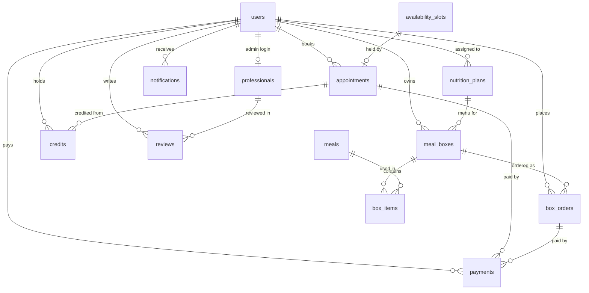

# ADR-001 — Domain data model

- **Status:** Accepted
- **Date:** 2026-07-25
- **Deciders:** @primo (database design, author), @egidio (architect, approve)
- **Consulted:** @ezio (backend), @severino (isolation & GDPR)
- **Task:** DEV-004 · **Supersedes:** — · **Amended by:** Amendment 1 (DEV-023)

> This ADR is the single source of truth for Meridia's schema. Every later epic
> (`DEV-0xx`) references it. Deviations require a new ADR that amends this one.

---

## Context

Meridia is a **single-studio** nutrition app (Studio Meridia, Pachino). Clients
book consultations, receive a personalized meal plan, and order a weekly meal box
(14 meals); the studio (`admin`) manages availability, assigns plans, and sends
profiled notifications. Before implementing features we need a coherent schema:
entities, keys, indexes, ownership columns, money representation, and the enums the
demo implies.

The starter scaffold already ships two tables (`users`, `appointments`) that made
the backend runnable. This ADR **supersedes those provisional shapes** — notably
`appointments.price_eur` (whole euros) becomes `price_cents`.

### Forces

- **Per-user isolation (Rule 4).** A `cliente` reads/writes only their own rows.
  Every owned table therefore carries an explicit `client_id` ownership column that
  every query filters on; it is never inferred from a join.
- **Single studio.** There is exactly one professional; we model it as a first-class
  `professional` row rather than a tenant. No multi-tenant columns.
- **Money is integer cents (Rule 7).** No floats, no `Decimal` columns for storage.
  Currency is EUR throughout (implicit); amounts are `int` cents.
- **Time is timezone-aware UTC (Rule 7).** All timestamps stored UTC; the client
  renders Europe/Rome.
- **SQLModel only (Rule 2).** Tables are `SQLModel, table=True`, registered in
  `backend/app/models/__init__.py` for Alembic autogenerate.

---

## Decision

### Conventions (apply to every table)

| Concern | Convention |
|--------|------------|
| Primary key | `id: int` surrogate, autoincrement. |
| Money | `*_cents: int` (EUR cents). Never float/Decimal columns. |
| Time | `datetime` stored UTC, tz-aware; `created_at` on every table, `updated_at` where mutated. |
| Ownership | Owned rows carry `client_id -> users.id`, indexed; queried with `where(client_id == current_user.id)`. |
| Enums | Python `str, Enum` persisted as their string value (stable, human-readable in DB). |
| Naming | tables `snake_case` plural; FKs `<entity>_id`; booleans `is_*`. |
| Soft state | We do **not** hard-delete domain rows with history (appointments, orders); we transition a `status` enum. Reference tables may hard-delete. |
| Deletion (GDPR) | Account erasure is handled by DEV-093, not per-feature cascades. |

### Entities

Legend: **PK** primary key · **FK** foreign key · **IDX** indexed · **⊙** ownership column (isolation filter).

#### `users`
The account for a client **or** the studio admin/nutritionist login.

| Column | Type | Notes |
|--------|------|-------|
| id | int | **PK** |
| email | str(255) | **IDX**, unique |
| hashed_password | str(255) | bcrypt |
| full_name | str(120) | |
| role | enum `UserRole` | `cliente` \| `admin`, **IDX** |
| is_active | bool | default true |
| created_at | datetime | UTC |

#### `professionals`
The studio's nutritionist (Dott.ssa Serra). One row expected; modeled explicitly so
bio/rating/reviews have a home. Optional `user_id` links the admin login.

| Column | Type | Notes |
|--------|------|-------|
| id | int | **PK** |
| user_id | int? | **FK** users.id, nullable |
| full_name | str(120) | |
| title | str(120) | e.g. "Biologa Nutrizionista" |
| bio | str(2000) | Italian |
| rating_avg | int | cents-of-a-star ×100 (e.g. 487 = 4.87) to stay integer |
| reviews_count | int | denormalized counter |
| created_at | datetime | |

#### `availability_slots`
Studio-managed open/closed consultation slots (demo admin toggles times).

| Column | Type | Notes |
|--------|------|-------|
| id | int | **PK** |
| starts_at | datetime | **IDX**, UTC |
| duration_min | int | 60 (prima) / 30 (controllo) capacity |
| is_open | bool | studio toggle, **IDX** |
| held_by_appointment_id | int? | **FK** appointments.id — set when booked (lifecycle) |
| created_at | datetime | |

> Uniqueness: a partial/unique index on `starts_at` prevents duplicate slots.

#### `appointments` ⊙
A consultation booked by a client. **Amends the scaffold** (`price_eur` → `price_cents`).

| Column | Type | Notes |
|--------|------|-------|
| id | int | **PK** |
| client_id | int | **⊙ FK** users.id, **IDX** |
| slot_id | int? | **FK** availability_slots.id |
| visit_type | enum `VisitType` | `prima` (€90) \| `controllo` (€50) |
| scheduled_at | datetime | **IDX**, UTC |
| status | enum `AppointmentStatus` | `pending_payment` \| `confirmed` \| `cancelled` \| `completed`, **IDX** |
| price_cents | int | 9000 / 5000 |
| cancelled_at | datetime? | for the 48h credit rule (DEV-050) |
| created_at | datetime | |

#### `nutrition_plans` ⊙
A plan assigned by the studio; unlocks the box (persona `new` = no plan → locked).

| Column | Type | Notes |
|--------|------|-------|
| id | int | **PK** |
| client_id | int | **⊙ FK** users.id, **IDX** |
| name | str(120) | e.g. "Dimagrimento 1400 kcal" |
| daily_kcal | int | |
| weeks | int | plan length |
| is_active | bool | one active plan per client |
| assigned_by | int? | **FK** users.id (admin) |
| created_at | datetime | |

#### `meals`
Reference catalog of prepared meals (kcal + macros). Not owned — shared menu data.

| Column | Type | Notes |
|--------|------|-------|
| id | int | **PK** |
| title | str(160) | Italian |
| slot | enum `MealSlot` | `lunch` \| `dinner` |
| kcal | int | |
| protein_g | int | |
| carb_g | int | |
| fat_g | int | |
| asset_ref | str(255)? | emoji/image key |
| storage_note | str(500)? | conservazione |
| reheat_note | str(500)? | riscaldamento |
| created_at | datetime | |

#### `meal_boxes` ⊙  and  `box_items`
The weekly menu (14 meals = 7 days × lunch/dinner) tied to a client's plan + week.

`meal_boxes`

| Column | Type | Notes |
|--------|------|-------|
| id | int | **PK** |
| client_id | int | **⊙ FK** users.id, **IDX** |
| plan_id | int | **FK** nutrition_plans.id |
| week_index | int | which week of the plan, **IDX** |
| created_at | datetime | |

`box_items` (join meal → box slot)

| Column | Type | Notes |
|--------|------|-------|
| id | int | **PK** |
| box_id | int | **FK** meal_boxes.id, **IDX** |
| meal_id | int | **FK** meals.id |
| weekday | int | 0–6 |
| slot | enum `MealSlot` | lunch/dinner |

> Unique index `(box_id, weekday, slot)` → exactly one meal per box slot.

#### `box_orders` ⊙
A client's order for a box: single (€89) or subscription (€79/box) with a pickup.

| Column | Type | Notes |
|--------|------|-------|
| id | int | **PK** |
| client_id | int | **⊙ FK** users.id, **IDX** |
| box_id | int? | **FK** meal_boxes.id (the week ordered) |
| plan_type | enum `OrderPlan` | `single` \| `subscription` |
| pickup | enum `PickupSlot` | `mattina` \| `pomeriggio` |
| status | enum `OrderStatus` | `pending_payment` \| `paid` \| `in_preparation` \| `ready` \| `collected` \| `cancelled`, **IDX** |
| amount_cents | int | 8900 / 7900, server-authoritative |
| created_at | datetime | |

> `Pickup` from the entity table is folded into `box_orders.pickup` (enum) rather than
> a separate table — it has no independent lifecycle.

#### `payments` ⊙
Records a payment against an appointment **or** an order. **Never stores PAN** — only a
provider token (DEV-070; @severino sign-off).

| Column | Type | Notes |
|--------|------|-------|
| id | int | **PK** |
| client_id | int | **⊙ FK** users.id, **IDX** |
| appointment_id | int? | **FK** appointments.id (xor with order_id) |
| order_id | int? | **FK** box_orders.id |
| amount_cents | int | server-computed |
| method | enum `PayMethod` | `apple_pay` \| `google_pay` \| `card` |
| provider_token | str(255) | opaque PSP token — **no raw card data** |
| status | enum `PayStatus` | `pending` \| `succeeded` \| `failed`, **IDX** |
| idempotency_key | str(64) | **IDX**, unique — idempotent confirmation |
| created_at | datetime | |

#### `credits` ⊙
A 6-month credit issued on a >48h cancellation (DEV-050).

| Column | Type | Notes |
|--------|------|-------|
| id | int | **PK** |
| client_id | int | **⊙ FK** users.id, **IDX** |
| amount_cents | int | |
| reason | str(255) | e.g. "Cancellazione appuntamento" |
| source_appointment_id | int? | **FK** appointments.id |
| expires_at | datetime | **IDX**, issued_at + 6 months |
| consumed_at | datetime? | null = still available |
| created_at | datetime | |

#### `notifications` ⊙
Behavior-profiled messages listed to the client (push delivery is later).

| Column | Type | Notes |
|--------|------|-------|
| id | int | **PK** |
| client_id | int | **⊙ FK** users.id, **IDX** |
| kind | enum `NotifKind` | reminder, order_deadline, box_ready, post_consult, win_back, checkup, birthday, promo |
| title | str(160) | Italian |
| body | str(1000) | Italian |
| is_read | bool | **IDX**, default false |
| created_at | datetime | **IDX** |

#### `reviews`
A review on the professional (public-ish, shown on the Consulenza card).

| Column | Type | Notes |
|--------|------|-------|
| id | int | **PK** |
| professional_id | int | **FK** professionals.id, **IDX** |
| author_id | int? | **FK** users.id (nullable for seeded demo reviews) |
| author_name | str(120) | display name captured at review time (Amendment 1) |
| rating | int | 1–5 |
| body | str(1000) | Italian |
| created_at | datetime | |

### ERD

### Enums (canonical values)

| Enum | Values |
|------|--------|
| UserRole | cliente, admin |
| VisitType | prima, controllo |
| AppointmentStatus | pending_payment, confirmed, cancelled, completed |
| MealSlot | lunch, dinner |
| OrderPlan | single, subscription |
| PickupSlot | mattina, pomeriggio |
| OrderStatus | pending_payment, paid, in_preparation, ready, collected, cancelled |
| PayMethod | apple_pay, google_pay, card |
| PayStatus | pending, succeeded, failed |
| NotifKind | reminder, order_deadline, box_ready, post_consult, win_back, checkup, birthday, promo |

### Index summary (beyond PKs)

- `users(email)` unique, `users(role)`.
- `availability_slots(starts_at)` unique, `availability_slots(is_open)`.
- Every ⊙ table: `(client_id)` — and composite `(client_id, status)` on
  `appointments`, `box_orders` for the common "my active items" query.
- `box_items(box_id, weekday, slot)` unique.
- `payments(idempotency_key)` unique.
- `credits(expires_at)`, `notifications(client_id, is_read)`, `notifications(created_at)`.

---

## Consequences

**Positive**

- Isolation is structural: every owned table has `client_id`, so the Rule-4 filter is
  uniform and auditable (`@severino` can grep for it).
- Money and time rules are encoded once (cents, UTC) — no per-feature drift.
- Enums-as-strings keep the DB readable and migrations additive (new values append).
- The ERD gives each epic a stable contract; `box`/`order`/`payment` lifecycles are
  explicit status machines rather than booleans.

**Negative / trade-offs**

- Denormalized counters (`professionals.rating_avg`, `reviews_count`) need consistent
  updates — owned by the reviews service, covered by tests.
- Modeling the single professional as a table is mild over-engineering today but
  avoids a painful migration if the studio ever adds staff.
- `rating_avg` as an integer ×100 avoids floats at the cost of a render-time divide.

**Migration note.** The scaffold's `appointments.price_eur` is renamed to `price_cents`
with a data migration (×100) when DEV-021 lands; until then the two starter tables
remain as-is and are the only tables in the DB.

**Follow-ups referenced by later epics:** availability/booking (DEV-020/021),
plan+box (DEV-030/031), orders (DEV-040), credits (DEV-050), notifications (DEV-060),
payments (DEV-070, its own ADR-002 for the provider abstraction), GDPR erasure (DEV-093).

---

## Amendments

### Amendment 1 (DEV-023) — `reviews.author_name`

- **Date:** 2026-07-26 · **Author:** @ezio · **Approved:** @egidio · **Consulted:** @severino

Adds a denormalized `author_name: str(120)` column to `reviews`. The original shape
carried only a nullable `author_id`, which leaves seeded demo reviews (no account)
with no name to display, and would lose the reviewer's name if the account is later
erased (DEV-093). Capturing the display name at write time keeps the Consulenza card
rendering correctly in both cases and is GDPR-friendlier (the review no longer depends
on the user row surviving). `author_id` remains the link to a real account when one
exists. No other table changes; the addition is additive and does not affect isolation
(reviews are studio reference data, not per-user owned).
